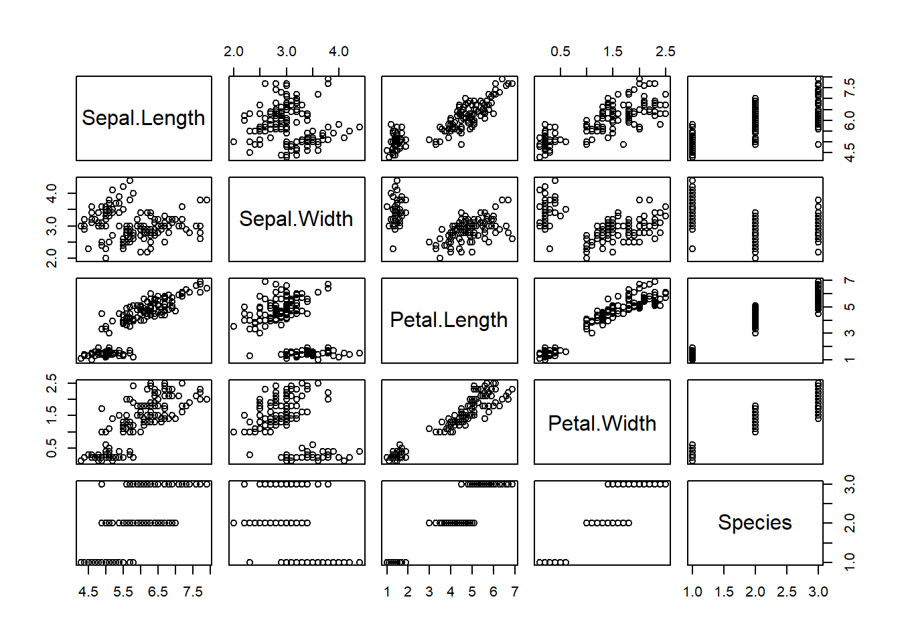

> **Daftar Isi**
>
> - [Visualisasi Data Menggunakan Fungsi plot](#4-1-visualisasi-data-menggunakan-fungsi-plot())
> - [Matriks Scatterplot](#4-2-matriks-scatterplot)
> - [Box plot](#4-3-box-plot)
> - [Bar Plot](#4-4-bar-plot)
> - [Line Plot](#4-5-line-plot)
> - [Pie Chart](#4-6-pie-chart)
> - [Histogram dan Density Plot](#4-7-histogram-dan-density-plot)
> - [QQ Plot](#4-8-qq-plot)


## 4.1 Visualisasi Data Menggunakan Fungsi plot()

Fungsi `plot()` merupakan fungsi umum yang digunakan untuk membuat plot pada `R`. Format dasarnya adalah sebagai berikut:


```r
plot(x, y, type="p")
```

> **Note: **
>
> - **x dan y**: titik koordinat plot Berupa variabel dengan panjang atau jumlah observasi yang sama.
> - **type**: jenis grafik yang hendak dibuat. Nilai yang dapat dimasukkan antara lain:
>   + type="p" : membuat plot titik atau scatterplot. Nilai ini merupakan default pada fungsi `plot()`.
>   + type="l" : membuat plot garis.
>   + type="b" : membuat plot titik yang terhubung dengan garis.
>   + type="o" : membuat plot titik yang ditimpa oleh garis.
>   + type="h" : membuat plot garis vertikal dari titik ke garis y=0.
>   + type="s" : membuat fungsi tangga.
>   + type="n" : tidak membuat grafik plot sama sekali, kecuali plot dari axis. Dapat digunakan untuk mengatur tampilan suatu plot utama yang diikuti oleh sekelompok plot tambahan.

Untuk lebih memahaminya berikut penulis akan sajikan contoh untuk masing-masing grafik tersebut. Berikut adalah contoh sintaks dan hasil plot yang disajikan pada Figure \@ref(fig:plot):


```r
# membuat vektor data 
x <- c(1:10); y <- x^2
```


```r
# membagi jendela grafik menajdi 4 baris dan 2 kolom
par(mfrow=c(3,3))

# loop
type <- c("p","l","b","o","h","s","n")
for (i in type){
  plot(x,y, type= i,
       main= paste("type=", i))
}
```

<div class="figure" style="text-align: center">

<p class="caption">(\#fig:plot)Plot berbagai jenis setting type</p>
</div>


Pada contoh selanjutnya akan dilakukan plot terhadap dataset `trees`. Untuk memuatnya jalankan sintaks berikut:

```r
library(tibble)
```


```r
# memuat dataset
trees <- as_tibble(trees)

# print 
trees
```

```
## # A tibble: 31 x 3
##    Girth Height Volume
##    <dbl>  <dbl>  <dbl>
##  1   8.3     70   10.3
##  2   8.6     65   10.3
##  3   8.8     63   10.2
##  4  10.5     72   16.4
##  5  10.7     81   18.8
##  6  10.8     83   19.7
##  7  11       66   15.6
##  8  11       75   18.2
##  9  11.1     80   22.6
## 10  11.2     75   19.9
## # ... with 21 more rows
```

Pada dataset tersebut kita ingin membuat scatterplot untuk melihat korelasi antara variabel `Height` dan `Volume`. Untuk melakukannya jalankan sintaks berikut:


```r
plot(trees$Height, trees$Volume)
```


```r
# atau 
with(trees, plot(Height, Volume))
```

<div class="figure" style="text-align: center">

<p class="caption">(\#fig:scatter)Scatterplot Height vs Volume</p>
</div>

Kita juga dapat menggunakan formula untuk membuat scatterplot pada Figure \@ref(fig:scatter). Berikut adalah contoh sintaks yang digunakan:


```r
x <- trees$Height
y <- trees$Volume

plot(y~x)
```

Fungsi `plot()` juga dapat digunakan untuk membentuk matriks scatterplot. Untuk membuatnya kita hanya perlu memasukkan seluruh dataset kedalam fungsi `plot()`. Berikut adalah sintaks dan output yang dihasilkan berupa Figure \@ref(fig:scatter2):


```r
plot(trees)
```

<div class="figure" style="text-align: center">

<p class="caption">(\#fig:scatter2)Matriks scatterplot dataset trees</p>
</div>

Selain itu jika kita memasukkan objek `lm()` yang merupakan fungsi untuk melakukan operasi regresi linier pada fungsi `plot()`, output yang dihasilkan berupa plot diagnostik yang berguna untuk menguji asumsi model regresi linier. Berikut adalah contoh sintaks dan output yang dihasilkan pada Figure \@ref(fig:diag):


```r
# membagi jendela grafik menjadi 2 baris dan 2 kolom
par(mfrow=c(2,2))

# plot
plot(lm(Volume~Height, data=trees))
```

<div class="figure" style="text-align: center">

<p class="caption">(\#fig:diag)Plot diagnostik regresi linier</p>
</div>


Selain objek-objek tersebut, fungsi `plot()` akan banyak digunakan dalam analisis statistika kita pada chapter lainnya.

## 4.2 Matriks Scatterplot

Pada bagian sebelumnya kita telah belajar bagaimana membuat matriks scatterplot mengggunakan fungsi `plot()`. Pada bagian ini kita akan belajar cara membuat matriks scatterplot menggunakan fungsi `pairs()`. Secara umum format fungsi dituliskan sebagai berikut:


```r
pairs(data, lower.panel=NULL)
```

> **Note: **
>
> - **data**: data frame
> - **lower.panel**: menampilkan atau tidak menampilkan panel bawah

Untuk lebih memahami penggunaan fungsi tersebut, berikut akan disajikan contoh penggunaannya pada dataset `iris`. Sebelum melakukannya jalankan sintaks berikut untuk memuat dataset:


```r
# memuat dataset irir
iris <- as_tibble(iris)

# print
iris
```

```
## # A tibble: 150 x 5
##    Sepal.Length Sepal.Width Petal.Length Petal.Width Species
##           <dbl>       <dbl>        <dbl>       <dbl> <fct>  
##  1          5.1         3.5          1.4         0.2 setosa 
##  2          4.9         3            1.4         0.2 setosa 
##  3          4.7         3.2          1.3         0.2 setosa 
##  4          4.6         3.1          1.5         0.2 setosa 
##  5          5           3.6          1.4         0.2 setosa 
##  6          5.4         3.9          1.7         0.4 setosa 
##  7          4.6         3.4          1.4         0.3 setosa 
##  8          5           3.4          1.5         0.2 setosa 
##  9          4.4         2.9          1.4         0.2 setosa 
## 10          4.9         3.1          1.5         0.1 setosa 
## # ... with 140 more rows
```

Untuk membuat matriks scatterplot kita hanya perlu memasukkan objek `iris` kedalam fungsi `pairs()`. Berikut adalah sintaks yang digunakan dan output yang dihasilkan pada Figure \@ref(fig:matscat):


```r
pairs(iris)
```

<div class="figure" style="text-align: center">

<p class="caption">(\#fig:matscat)Matriks scatterplot iris</p>
</div>

Kita dapat melakukan drop terhadap panel bawah grafik tersebut. Untuk melakukannya kita perlu memasukkan parameter `lower.panel=NULL`. Output yang dihasilkan akan tampak seperti pada Figure \@ref(fig:matscat2).


```r
pairs(iris, lower.panel=NULL)
```

<div class="figure" style="text-align: center">

<p class="caption">(\#fig:matscat2)Matriks scatterplot iris tanpa panel bawah</p>
</div>

Kita dapat merubah warna titik berdasarkan factor `Species`. Langkah pertama yang perlu dilakukan adalah melakukan drop variabel `Species` pada dataset dan memasukkan objek baru tanpa variabel tersebut kedalam fungsi `pairs()`. Warna berdasarkan grup diberikan dengan menambahkan parameter `col= ` pada fungsi `pairs()`. Berikut adalah contoh penerapannya dan output yang dihasilkan pada Figure \@ref(fig:matscat3):


```r
# drop variabel Species
# simpan dataset baru pada objek iris2
iris2 <- iris[ ,1:4]

# print
iris2
```

```
## # A tibble: 150 x 4
##    Sepal.Length Sepal.Width Petal.Length Petal.Width
##           <dbl>       <dbl>        <dbl>       <dbl>
##  1          5.1         3.5          1.4         0.2
##  2          4.9         3            1.4         0.2
##  3          4.7         3.2          1.3         0.2
##  4          4.6         3.1          1.5         0.2
##  5          5           3.6          1.4         0.2
##  6          5.4         3.9          1.7         0.4
##  7          4.6         3.4          1.4         0.3
##  8          5           3.4          1.5         0.2
##  9          4.4         2.9          1.4         0.2
## 10          4.9         3.1          1.5         0.1
## # ... with 140 more rows
```

```r
# spesifikasi vaktor warna titik berdasarkan spesies
my_col <- c("#00AFBB", "#E7B800", "#FC4E07")

# plot
pairs(iris2, lower.panel=NULL,
      # spesifikasi warna
      col= my_col[iris$Species])
```

<div class="figure" style="text-align: center">

<p class="caption">(\#fig:matscat3)Matriks scatterplot iris tanpa panel bawah</p>
</div>

Kita juga dapat mengganti panel bawah menjadi nilai korelasi antar variabel. Untuk melakukannya kita perlu mendefinisikan sebuah fungsi untuk panel bawah dan panel atas (jika ingin warna titik berdasarkan factor). Setelah fungsi panel bawah dan atas didefinisikan, langkah selanjutnya adalah melakukan memasukkan nilainya kedalam fungsi `pairs()`. Berikut adalah sintaks yang digunakan serta output yang dihasilkan pada Figure \@ref(fig:matscat4):


```r
# membuat fungsi untuk menghitung
# nilai korelasi yang ditempatkan pada panel bawah
panel.cor <- function(x, y){
    # definisi parameter grafik 
    usr <- par("usr"); on.exit(par(usr))
    par(usr = c(0, 1, 0, 1))
    # menghitung koefisien korelas
    r <- round(cor(x, y), digits=2)
    # menambahkan text berdasarkan koefisien korelasi
    txt <- paste0("R = ", r)
    # mengatur besar text sesuai besarnya nilai korelasi
    cex.cor <- 0.8/strwidth(txt)
    text(0.5, 0.5, txt, cex = cex.cor * abs(r))
}

# kustomisasi panel atas agar
# warna titik berdasarkan factor
my_col <- c("#00AFBB", "#E7B800", "#FC4E07")
upper.panel<-function(x, y){
  points(x,y, col = my_col[iris$Species])
}

pairs(iris2,
      lower.panel= panel.cor,
      upper.panel= upper.panel)
```

<div class="figure" style="text-align: center">

<p class="caption">(\#fig:matscat4)Matriks scatterplot iris dengan koefisien korelasi</p>
</div>

Jika kita tidak ingin nilai korelasi ditampilkan di panel bawah, kita dapat merubahnya sehingga dapat tampil pada panel atas bersamaan dengan scatterplot. Untuk melakukannya kita perlu mendefinisikan fungsi pada panel atas dan memasukkannya pada parameter `upper.panel= `. Berikut adalah sintaks yang digunakan beserta output yang dihasilkan pada Figure \@ref(fig:matscat5):


```r
# kustomisasi panel atas
upper.panel<-function(x, y){
  points(x,y, col=c("#00AFBB", "#E7B800", "#FC4E07")[iris$Species])
  r <- round(cor(x, y), digits=2)
  txt <- paste0("R = ", r)
  usr <- par("usr"); on.exit(par(usr))
  par(usr = c(0, 1, 0, 1))
  text(0.5, 0.9, txt)
}

# plot
pairs(iris2, lower.panel = NULL, 
      upper.panel = upper.panel)
```

<div class="figure" style="text-align: center">

<p class="caption">(\#fig:matscat5)Matriks scatterplot iris dengan koefisien korelasi di panel atas</p>
</div>

## 4.3 Box plot

Box plot pada `R` dapat dibuat menggunakan fungsi `boxplot()`. Berikut adalah sintaks untuk membuat boxplot variabel `Sepal.Lenght` pada dataset `iris` dan output yang dihasilkan pada Figure \@ref(fig:boxplot):


```r
boxplot(iris$Sepal.Length)
```

<div class="figure" style="text-align: center">

<p class="caption">(\#fig:boxplot)Boxplot variabel Sepal.Length</p>
</div>

Boxplot juga dapat dibuat berdasarkan variabel factor. Hal ini berguna untuk melihat perbedaan ditribusi data pada masing-masing grup. Pada sintaks berikut dibuat boxplot berdasarkan variabel `Species`. Output yang dihasilkan disajikan pada Figure \@ref(fig:boxplot2):


```r
boxplot(iris$Sepal.Length~iris$Species)
```

<div class="figure" style="text-align: center">

<p class="caption">(\#fig:boxplot2)Boxplot berdasarkan variabel species</p>
</div>

Kita juga dapat mengubah warna outline dan box pada boxplot. Berikut adalah contoh sintaks yang digunakan untuk melakukannya dan output yang dihasilkan disajikan pada Figure \@ref(fig:boxplot3):


```r
boxplot(iris$Sepal.Length~iris$Species,
        # ubah warna outline menjadi steelblue
        border = "steelblue",
        # ubah warna box berdasarkan grup
        col= c("#999999", "#E69F00", "#56B4E9"))
```

<div class="figure" style="text-align: center">

<p class="caption">(\#fig:boxplot3)Boxplot dengan warna berdasarkan spesies</p>
</div>

Kita juga dapat membuat boxplot pada *multiple group*. Data yang digunakan untuk contoh tersebut adalah dataset `ToothGrowth`. Berikut adalah sintaks untuk memuat dataset tersebut:


```r
# memuat dataset sebagai tibble
ToothGrowth <- as_tibble(ToothGrowth)

# print
ToothGrowth
```

```
## # A tibble: 60 x 3
##      len supp   dose
##    <dbl> <fct> <dbl>
##  1   4.2 VC      0.5
##  2  11.5 VC      0.5
##  3   7.3 VC      0.5
##  4   5.8 VC      0.5
##  5   6.4 VC      0.5
##  6  10   VC      0.5
##  7  11.2 VC      0.5
##  8  11.2 VC      0.5
##  9   5.2 VC      0.5
## 10   7   VC      0.5
## # ... with 50 more rows
```

```r
# ubah variable dose menjadi factor
ToothGrowth$dose <- as.factor(ToothGrowth$dose)

# print
ToothGrowth
```

```
## # A tibble: 60 x 3
##      len supp  dose 
##    <dbl> <fct> <fct>
##  1   4.2 VC    0.5  
##  2  11.5 VC    0.5  
##  3   7.3 VC    0.5  
##  4   5.8 VC    0.5  
##  5   6.4 VC    0.5  
##  6  10   VC    0.5  
##  7  11.2 VC    0.5  
##  8  11.2 VC    0.5  
##  9   5.2 VC    0.5  
## 10   7   VC    0.5  
## # ... with 50 more rows
```

Contoh sintaks dan output boxplot *multiple group* disajikan pada Figure \@ref(fig:boxplot4):


```r
boxplot(len ~ supp*dose, data = ToothGrowth,
        col = c("white", "steelblue"))
```

<div class="figure" style="text-align: center">

<p class="caption">(\#fig:boxplot4)Boxplot multiple group</p>
</div>

## 4.4 Bar Plot

Barplot pada `R` dapat dibuat menggunakan fungsi `barplot()`. Untuk lebih memahaminya berikut disajikan contoh barplot menggunakan dataset `VADeaths`. Untuk memuatnya jalankan sintaks berikut:


```r
VADeaths
```

```
##       Rural Male Rural Female Urban Male Urban Female
## 50-54       11.7          8.7       15.4          8.4
## 55-59       18.1         11.7       24.3         13.6
## 60-64       26.9         20.3       37.0         19.3
## 65-69       41.0         30.9       54.6         35.1
## 70-74       66.0         54.3       71.1         50.0
```

Contoh bar plot untuk variabel `Rural Male` disajikan pada Figure \@ref(fig:barplot):


```r
par(mfrow=c(1,2))
barplot(VADeaths[, "Rural Male"], main="a")
barplot(VADeaths[, "Rural Male"], main="b", horiz=TRUE)
```

<div class="figure" style="text-align: center">

<p class="caption">(\#fig:barplot)a. bar plot vertikal, b. bar plot horizontal</p>
</div>


```r
par(mfrow=c(1,1))
```


Kita dapat mengubah warna pada masing-masing bar, baik outline bar maupun box pada bar. Selain itu kita juga dapat mengubah nama grup yang telah dihasilkan sebelumnya. Berikut sintaks untuk melakukannya dan output yang dihasilkan pada Figure \@ref(fig:barplot2):


```r
barplot(VADeaths[, "Rural Male"],
        # ubah warna ouline menjadi steelblue
        border="steelblue",
        # ubah wana box
        col= c("grey", "yellow", "steelblue", "green", "orange"),
        # ubah nama grup dari A sampai E
        names.arg = LETTERS[1:5],
        # ubah orientasi menajadi horizontal
        horiz=TRUE)
```

<div class="figure" style="text-align: center">

<p class="caption">(\#fig:barplot2)Kustomisasi bar plot</p>
</div>

Untuk bar plot dengan *multiple group*, tersedia dua pengaturan posisi yaitu *stacked bar plot*(menunjukkan proporsi penyusun pada masing-masing grup) dan *grouped bar plot*(melihat perbedaan individual pada masing-masing grup). Pada Figure \@ref(fig:barplot3) dan Figure \@ref(fig:barplot4), disajikan kedua jenis bar plot tersebut.


```r
# staked
barplot(VADeaths,
         col = c("lightblue", "mistyrose", "lightcyan", 
                 "lavender", "cornsilk"),
        legend = rownames(VADeaths))
```

<div class="figure" style="text-align: center">

<p class="caption">(\#fig:barplot3)Stacked bar plot</p>
</div>


```r
# grouped
barplot(VADeaths,
         col = c("lightblue", "mistyrose", "lightcyan", 
                 "lavender", "cornsilk"),
        legend = rownames(VADeaths), beside = TRUE)
```

<div class="figure" style="text-align: center">

<p class="caption">(\#fig:barplot4)Grouped bar plot</p>
</div>

## 4.5 Line Plot

Line plot pada `R` dapat dibentuk menggunakan fungsi `plot()`. Selain itu fungsi `lines()` dapat pula digunakan untuk menambahkan line plot pada grafik. Berikut adalah sintaks untuk membuat line plot dan outputnya pada Figure \@ref(fig:line):


```r
# Membuat vektor data
x <- c(1:20)
y <- 2*x
z <- x^2

# Membuat line plot x vs y
plot(y~x, type="b",
     lty=1,
     col="blue")

# Menambahkan line plot x vs z
lines(z~x, type="o",
      lty=2,
      col="red")

# Menambahkan legend
legend("topleft", legend=c("Line 1", "Line 2"),
       col=c("red", "blue"), lty = 1:2, cex=0.8)
```

<div class="figure" style="text-align: center">

<p class="caption">(\#fig:line)Line plot</p>
</div>

## 4.6 Pie Chart

Pie chart digunakan untuk membuat visualisasi proporsi pada sebuah data. Pie chart pada `R` dibuat menggunakan fungsi `pie()`. Berikut adalah sintaks untuk membuat pie chart dan output yang dihasilkan pada Figure \@ref(fig:pie):


```r
par(mar = c(0, 1, 0, 1))
pie(
  c(280, 60, 20),
  c('Sky', 'Sunny side of pyramid', 'Shady side of pyramid'),
  col = c('#0292D8', '#F7EA39', '#C4B632'),
  init.angle = -50, border = NA
)
```

<div class="figure" style="text-align: center">

<p class="caption">(\#fig:pie)Pie chart</p>
</div>

## 4.7 Histogram dan Density Plot

Fungsi `hist()` dapat digunakan untuk membuat histogram pada `R`. Secara sederhana fungsi tersebut didefinisikan sebagai berikut:

```r
hist(x, breaks="Sturges")
```

> **Note: **
>
> - **x**: vektor numerik
> - **breaks**: *breakpoints* antar sel histogram.

Pada dataset `trees` akan dibuat histogram variabel `Height`. Untuk melakukannya jalankan sintaks berikut:


```r
hist(trees$Height)
```

Output yang dihasilkan disajikan pada Figure \@ref(fig:hist): 

<div class="figure" style="text-align: center">

<p class="caption">(\#fig:hist)Histogram</p>
</div>

Density plot pada `R` dapat dibuat menggunakan fungsi `density()`. Berbeda dengan fungsi `hist()`, fungsi ini tidak langsung menghasilkan grafik densitas. Fungsi `density()` hanya menghitung kernel densitas pada data. Densitas yang telah dihitung selanjutnya diplotkan menggunakan fungsi `plot()`. Berikut adalah sintaks dan output yang dihasilkan pada  Figure \@ref(fig:dens):

<div class="figure" style="text-align: center">

<p class="caption">(\#fig:dens)Density plot</p>
</div>

Kita juga dapat menambahkan grafik densitas pada histogram sehingga mempermudah pembacaan pada histogram. Untuk melakukannya kita perlu mengubah kernel histigram dari frekuensi menjadi density dengan menambahkan parameter `freq=FALSE` pada fungsi `hist()`. Selanjutnya tambahkan fungsi `polygon()` untuk memplotkan grafik densitas. Berikut adalah sintak dan output yang dihasilkan pada  Figure \@ref(fig:denshist):

<div class="figure" style="text-align: center">

<p class="caption">(\#fig:denshist)Density plot dan histogram</p>
</div>

## 4.8 QQ Plot


